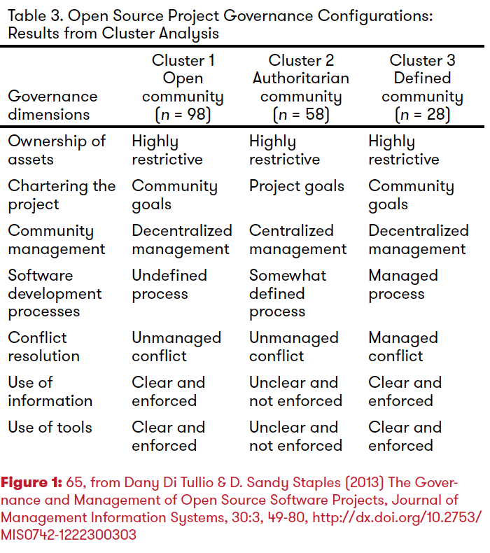
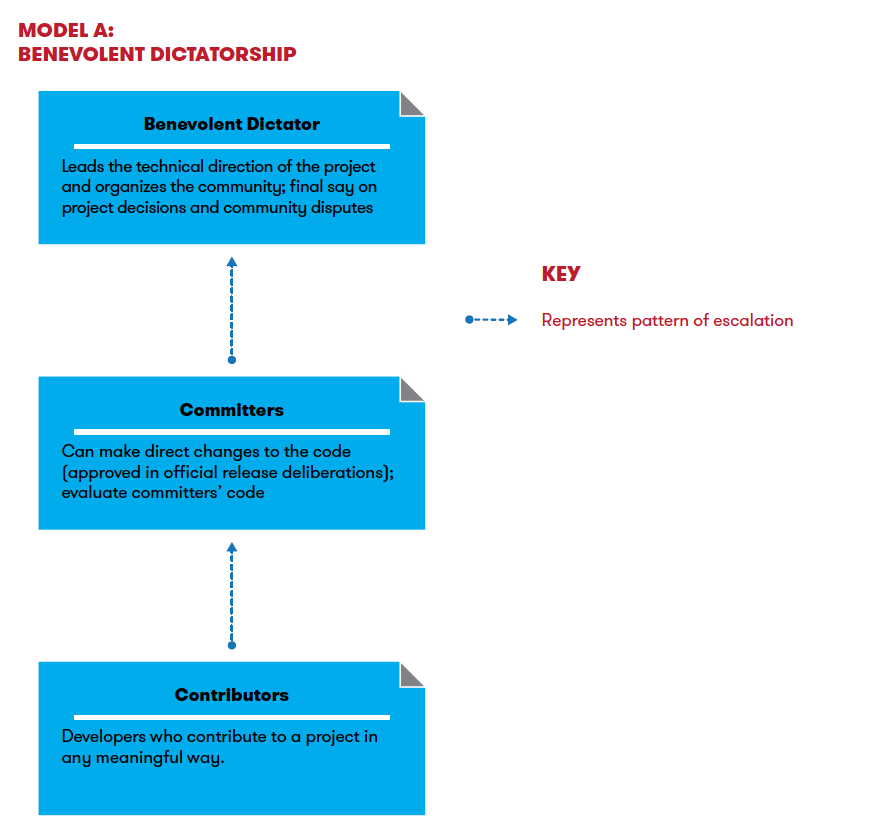
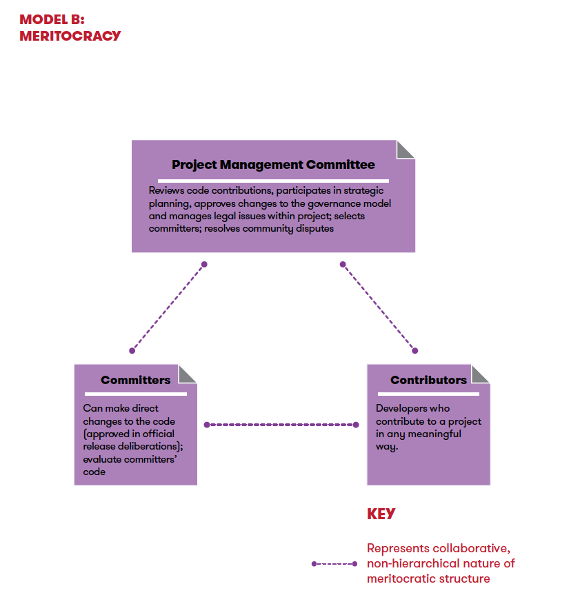
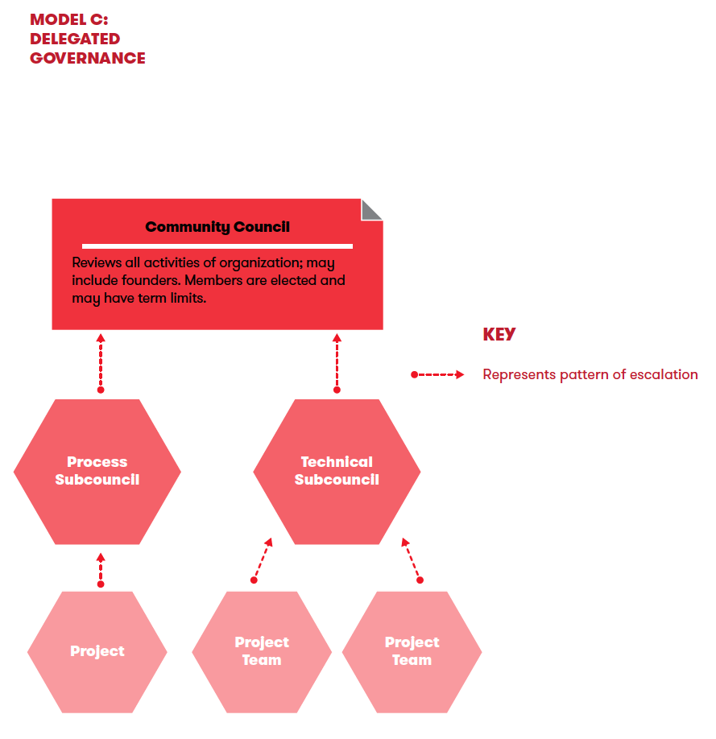
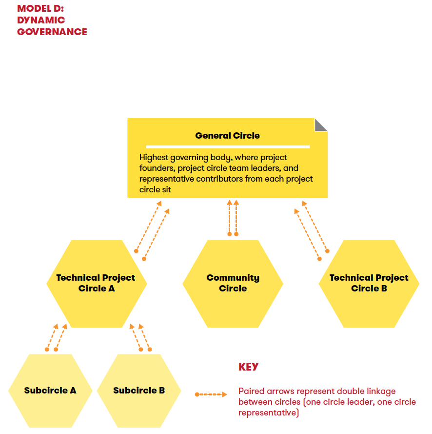
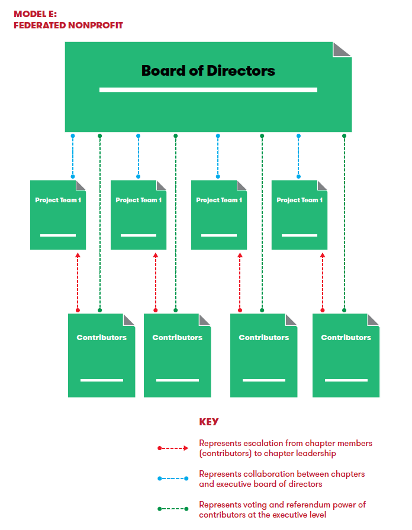

# 《开源软件开发机构的组织与架构》阅读笔记和感悟

这是一份 Harvard Law School Berkman Klein Center for Internet & Society 的一份报告，之所以选择阅读这篇文章，是因为基金会、开源社区的研究迫在眉睫，先抛开什么”贸易战“、”卡喉咙”之类的二元对立、非零和的内容，我们就软件的本质，以及其在现代经济下的中立孵化的必要性而言，开源软件是如此的重要和数量庞大，然而它的可持续性发展，以及企业的竞合关系要求中立的、非营利性质的组织，帮助开发者以最高效的生产力和生产方式作出支撑和创新，尤其以基础设施软件为甚。

当然，国内从开源软件的角度来研究组织和架构的内容还真不多。于是就有了这样一个旅程。

## 内容介绍

该报告就开源软件开发机构的结构、组织和治理方面的研究和思考。旨在the authors are hopeful the document provides a general overview of the complex issues that open source initiatives face when balancing a need for structure and continuity with the innovative and experimental spirit at the heart of many open source development projects.

全篇分为两个部分：

### 第一部分：开源软件机构的类型

该部分根据美国的税务、公司等法律，大体讲解了如501(c)3，501(c)4，501(c)6等法律的区别，以及营利、非营利、有限责任公司等组织的区别。并根据自己的开源软件的形式来决定。

> In fact, an organization must qualify for a tax exemption under federal tax law.

Internal Revenue Code(IRC) 谈到：“[c]orporations,and any community chest, fund, or foundation, organized and operated exclusively for religious, charitable, scientific, testing for public safety, literary, or educational purposes,”

其中牵扯到大量的关于公司法务相关的内容。请技术人员慎重入内。[捂脸]

就作者而言，意思是开源软件的孵化，除了501(c)3这样的非营利、慈善组织，还可以有其它的选择，甚至是营利性质的公司。仅从法律意义上说明。

> organizations that wish to generate profits while also furthering a social mission may consider incorporating as a benefit corporation. As the open source software community begins to move beyond 501(c)(3), organizations may move beyond a one-size-fits-all model and increasingly explore and experiment with new corporate structures that best fit their needs sand goals.

### 第二部分：开源世界的治理模式

作者是非常冷静的第三者，本身不带有对于计算机、软件之类的牵绊，完全是从政治的角度切入，比如举例大教堂与集市，也是从组织和治理而言的，甚至摆出了开源组织的控制模型：

是的，控制仍然是非常重要的，开源社区并非是一盘散沙、无组织、无纪律，甚至更为先进的组织方式。

接下来的部分，作者从开源组织的决策方式、成员角色、冲突解决等方式来将开源的机构区别为5中类型，下面笔者以表格的形式重新组织一下：

|  模式类型    |     角色       | 冲突解决 | 关键特色|案例
| -------------  | ------------- |:-------------:| -----:|-----:|
|仁慈的独裁者|benevolent dictator、提交者、贡献者|the dictator may not always intervene when conflict arises, choosing to remain on the sidelines as the community sorts out the problem, or until it asks for the dictator’s opinion.|1. 权威来自中心化。2. 社区对独裁者的看法会影响项目的成功。3.个人任务是临时的，功能决策通常取决于仁慈的独裁者|Linux 内核|
|精英制   |贡献者、提交者、委员会   | 懒人共识  |1. 没有权威。2.提交者在塑造项目中发挥着独特的作用。3.社区规范至关重要 |Apache|
|委托制   | contributors 、 committers、Council members  |  投票等方式|1.权限集中在顶层，但也通过一系列命令分发。2.许多社区成员可以担任某种形式的领导角色。3.对项目方向的控制将根据理事会的选择方式而有所不同。   |Ubuntu|
|动态治理   |   |   |1.决策权在整个社区中高度分散。2.需要一致性可能会限制社区增长潜力。3.在各个层面理解和接受审议过程和治理结构至关重要   ||
|非营利机构   |   |   |   ||
|联邦公益组织   |   |   |   ||

### 案例部分

Apache基金会、X.org、Yorba 基金会、Brave New Software等机构的介绍。一如既往，从法律和组织、治理的角度来看待这些组织。

## 治理模式图示

1. 仁慈的独裁者

2. 精英制

3. 委托

4. 非营利机构

5. 联邦公益组织

## X-lab 开放实验室评论

该报告可以说是完整的将开源软件研发机构的形态说明白了，无论是一位开源业内人士，还是有软件业务的企业界人士，对于开源软件的组织、治理、架构都有了明确的认识，尽管并没有涉及到具体的开源社区的设计，或者是某一具体项目的实际开发过程，但是从社会、法律、政治的角度来将几类开源软件研发机构摸了一个底。

在本土，经常有人说创建一个基金会之类的话题，本土没有像IRS这样的法律基础，所以类似501（C）之类的机构恐怕也是难以申请，有联盟性质的可以搞，也需要了解相关的政策和条文。所以第一部分对于申请者来说，可能要跑到人大去积极的提出建设性的建议，至于后者，可能更多的担忧不是一个组织架构或治理形式，而是实现目标的文化基础，如共识机制、沟通形式等等。

整体而言，仅仅具有学习和参考价值，并不能实际照搬到现实当中来进行实施。而这也是本土这么多年以来没有发展出一个非营利的软件基金会，也没有在基础设施软件孵化上作出像样的公共产品的最大原因。

这点我们有很大的责任和义务，去努力的根据历史现状来实现具有2000万开发者的庞大人群的生产力。
